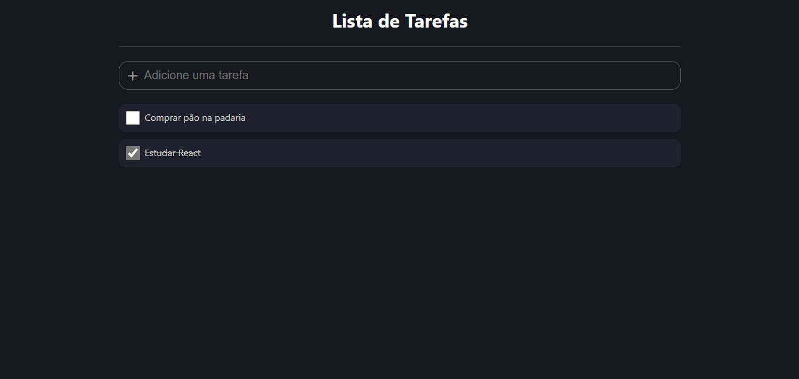

# TODO

Aplicação para o gerenciamento das atividades diária.

## Iniciando a aplicação

No diretório raiz do app, você deve executar:

### `yarn install`

Irá baixar as dependências necessárias ao projeto.

### `yarn start`

Executa o app no modo de desenvolvimento. A aplicação deverá está sendo executada em seu browser no endereço [http://localhost:3000](http://localhost:3000).

## Tecnologias

- [React](https://reactjs.org/)
- [TypeScript](https://www.typescriptlang.org)
- [Styled-Components](https://styled-components.com/)

